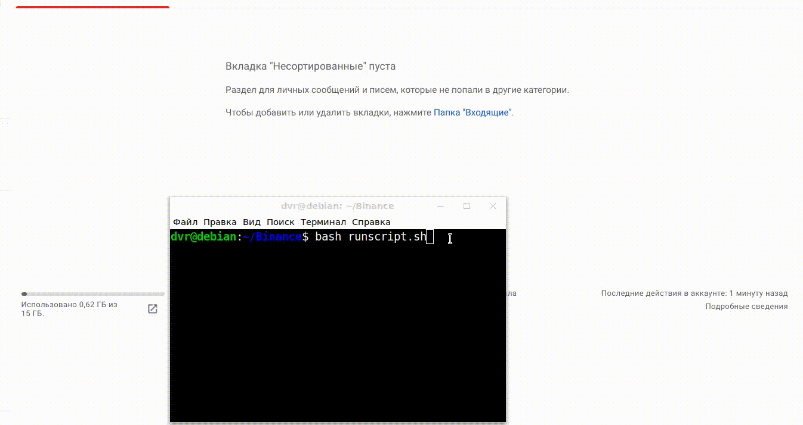

## Binance API + Email Message


This software solution receives data about the cryptocurrency market from the Binance API. Makes a selection in accordance with the specified parameters, and sends the result in the form of a table to the specified email addresses. If necessary, it is possible to place this product on a server for automatic processing and distribution of material at a specified time.
To automate the launch of this program on the local computer, a Bash script is used. If you need to set a specific time to run this program, you can use the Crontab service. On this gif, you can see a selection of ten pairs sorted in descending order in the "ИЗМЕНЕНИЕ ЦЕНЫ %:" column.


<p align="center"></p>


## Technology in the project

To receive data from the Binance API, the standard requests library is used. With frequent requests, Binance may block you, in which case an error message will appear: "Ошибка при получении данных!".
When sending requests through the bash script, there were no such problems, but when the program was launched in VS Code, such an error appeared over time:


```shell
def get_binance(**kwargs):
    url = "https://api1.binance.com/api/v3/ticker/24hr"

    params = {**kwargs}
    try:
        data = requests.get(url, params).json()
        return data
    except:
        print('Ошибка в получении данных!')
```

For unpacking data received from the Binance API, usually consisting of dictionaries and lists. The recursion function is used:


```python
def recurs_find_key(key, obj):
    if obj == None:
        return None
    else:
        if key in obj:
            return obj[key]
        if type(obj) == dict or type(obj) == list:
            for k, v in obj.items():
                if type(v) == dict:
                    result = recurs_find_key(key, v)
                    return result
                elif type(v) == list:
                    for el in range(len(v)):
                        result = recurs_find_key(key, v[el-1])
                        return result
```

Next, we distribute the unpacked data according to the selected keys, and at the end we set the sorting parameter by one of these keys, and indicate the amount of data we need top_data[:10].
The choice of the CHOICE_SORT sorting parameter is carried out in the config.py file.


```python
def get_top_data(json):
    top_data = []

    for cripta in json:
        cripta_dict = {}
        symbol = recurs_find_key('symbol', cripta)
        cripta_dict['symbol'] = symbol

        priceChange = recurs_find_key('priceChange', cripta)
        cripta_dict['priceChange'] = priceChange

        priceChangePercent = recurs_find_key('priceChangePercent', cripta)
        cripta_dict['priceChangePercent'] = priceChangePercent

        quoteVolume = recurs_find_key('quoteVolume', cripta)
        cripta_dict['quoteVolume'] = quoteVolume

        count = recurs_find_key('count', cripta)
        cripta_dict['count'] = count

        top_data.append(cripta_dict)
        top_data.sort(key=lambda i: float(i[CHOICE_SORT]), reverse=True)

    return top_data[:10]
```
In order to substitute the automatically collected parsed data into the html table, the jinja2 library is used:

```python
def create_message(top_data):

    env = Environment(
        loader = FileSystemLoader('templates'),
        autoescape=select_autoescape(['html', 'xml'])
    )

    template = env.get_template('table.html')
    message = template.render(items=top_data)

    return message

message = create_message(get_top_data(get_binance()))
```


Using the smtplib module built into Python, the table generated in the message is sent to the specified addressee.
Parameters (SENDER_EMAIL, EMAIL_PASSWORD, EMAIL_LIST) are located in the config.py folder:


```python
def send_email_with_binance(message, EMAIL_LIST):

    msg = MIMEMultipart('alternative')
    msg['Subject'] = "Binance"
    msg['From'] = SENDER_EMAIL
    msg['To'] = ', '.join(EMAIL_LIST)

    part1 = MIMEText(message, 'html')
    msg.attach(part1)

    with smtplib.SMTP_SSL('smtp.yandex.ru', 465) as smtp:

        smtp.login(SENDER_EMAIL, EMAIL_PASSWORD)
        smtp.send_message(msg)

send_email_with_binance(message, EMAIL_LIST)
